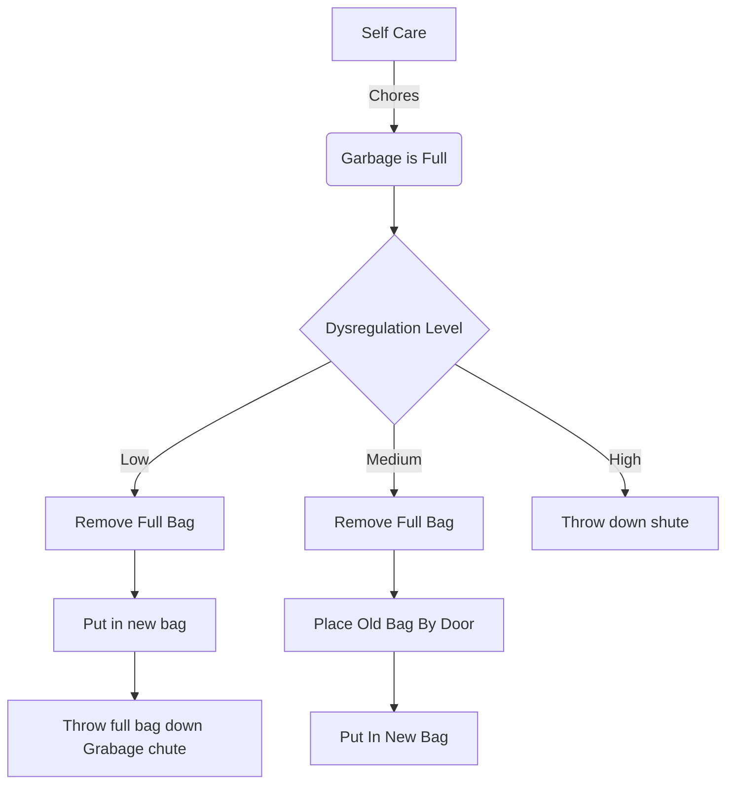

%%
- meta
	- UID: 202102271340
	- title: [MP - self care warning signs]
	- created: 2021-02-27 13:48
	- last updated: 
	- obsidian url:  [202102271340](obsidian://open?vault=not-a-robot&file=inbox%2F202102271340%20-%20MP%20-%20self%20care%20warning%20signs)
%%

%%[[+ Self Care MoC]]  [[warning signs]] [[self care warning signs]] %%
# Self Care Warning Signs - the garage bins 

My energy levels have been a bit all over the place the past week, and have seen some self-care warning signs pop up, another one that tends to happen

- self care
	- cleaning
		- garbage bins left full
			- I'll start taking things directly to the garbage shut instead of emptying the garbage 

I'll be so caught up in the moment, that when the garbage is full - instead of taking it out, I'll end up either

- Shoving it into the garbage in a different room, like the bathroom
- Walk across the hall and throw it down the garbage chute

The garbage filling up fast, tends to be a side-effect of another warning sign:

- Eating out too often / Timmies for every meal

Empty XXL Tim Horton coffee cups take up a lot of space. 

If I've been getting it daily, sometimes a few times a day for breakfast and/or lunch, it's probably because I haven't taken the time to go grocery shopping recently - or, I am too low energy to make anything.

While having the garbage chute across the hall is rather handy, it can give the illusion of 'this place looks pretty clean', because there isn't much garbage or clutter around, but it's because the garbage cans are full - and I'm taking them right to the chute.  